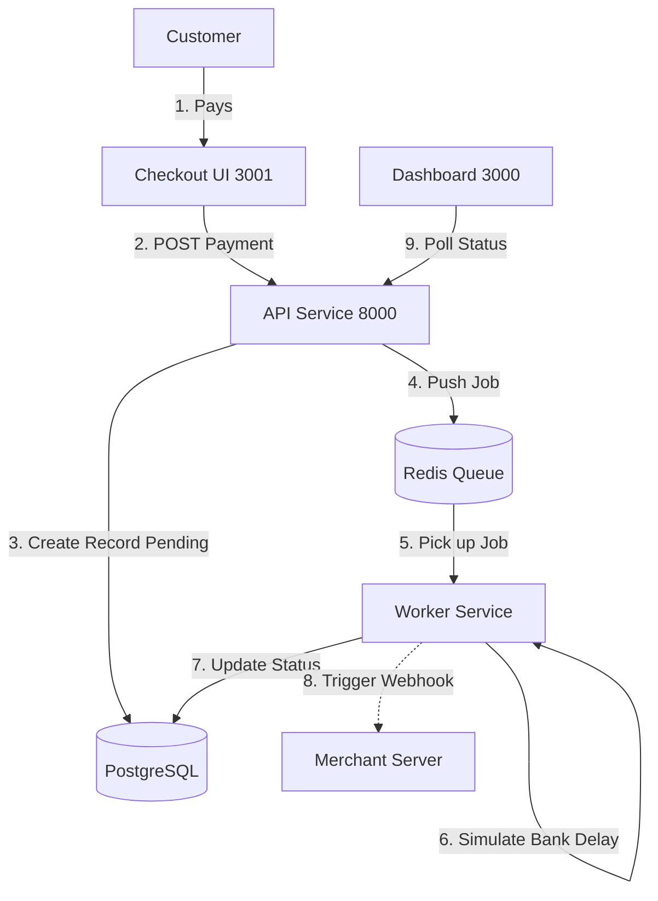

# Payment Orchestrator

## Overview
**Payment Orchestrator** is a full-stack payment gateway project that replicates the real-world building blocks of modern processors like **Razorpay / Stripe**.  
Instead of being a simple CRUD system, it focuses on **asynchronous payment execution**, **high concurrency**, and **reliable webhook delivery** to keep merchant and customer experiences consistent.

Merchants can onboard, create orders, accept payments through a hosted checkout, and track the complete transaction lifecycle. The system also simulates real payment conditions such as **network latency** and **bank failures** to showcase fault tolerance.

---

##  Tech Stack (PERN + Redis)
- **Database:** PostgreSQL 15 (Docker)
- **Backend:** Node.js + Express
- **Frontend (Merchant Dashboard):** React + Vite + TailwindCSS
- **Frontend (Hosted Checkout):** React + Vite + TailwindCSS
- **Queue Engine:** Redis 7 + BullMQ
- **Infrastructure:** Docker + Docker Compose

---

## System Diagram

##  What This Project Demonstrates
- **Merchant Dashboard**
  - Merchant login + API credential management
  - Transaction list + real-time status updates
  - Basic analytics & monitoring

- **Hosted Checkout**
  - Separate checkout interface (micro-frontend style)
  - Supports **UPI** and **Card payments**
  - Card validation using **Luhn Algorithm**

- **Asynchronous Payment Processing**
  - API creates a transaction in `pending` state
  - Payment execution happens in a **background worker**
  - Redis queue ensures the API stays fast under load

- **Webhook Notifications with Retries**
  - Merchant systems are notified on status changes (`success`, `failed`, etc.)
  - Retry strategy with exponential backoff (up to **5 attempts**) for reliability

- **Idempotency Protection**
  - Prevents duplicate payments when clients retry requests
  - Uses idempotency keys to return consistent results

- **Refunds**
  - Full and partial refunds
  - Server-side validation to ensure refund amounts never exceed paid amount

## How to Run It
The entire application stack is containerized.

1. **Clone the repository:**
   `bash
   git clone https://github.com/Rampeddireddi/Payment_Gateway_Extension
   cd Payment_Gateway_Extension
   `

2. **Start the services:**
   `bash
   docker-compose up -d --build
   
3. **Verify Status:**
   Ensure the following 6 containers are active: `api`, `worker`, `db`, `redis`, `dashboard`, and `checkout`.

` **Backend API** ` `http://localhost:8000` ` The core REST API handling business logic. `
` **Merchant Dashboard** ` `http://localhost:3000` ` Administration interface for merchants. `
` **Customer Checkout** ` `http://localhost:3001` ` The client-facing payment interface. `

## 🧪 Quick Test Flow
To verify the system functionality:

1.  **Access the Dashboard** at `http://localhost:3000` using default credentials:
    * Email: `test@example.com`
    * Secret: `secret_test_xyz789`
2.  **Generate an Order** via terminal:
    `bash
    curl -X POST http://localhost:8000/api/v1/orders \
      -H "Content-Type: application/json" \
      -H "X-Api-Key: key_test_abc123" \
      -H "X-Api-Secret: secret_test_xyz789" \
      -d '{"amount": 50000, "currency": "INR", "receipt": "demo_1"}'
    `
3.  **Process Payment:** Copy the `id` from the response and navigate to:
    `http://localhost:3001/checkout?order_id=YOUR_ORDER_ID`
4.  **Verify Results:** Complete the payment using UPI (`test@upi`). The transaction status will update automatically on the Dashboard.
